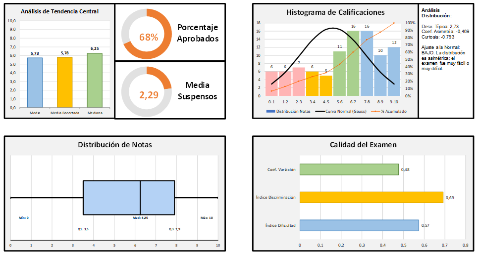
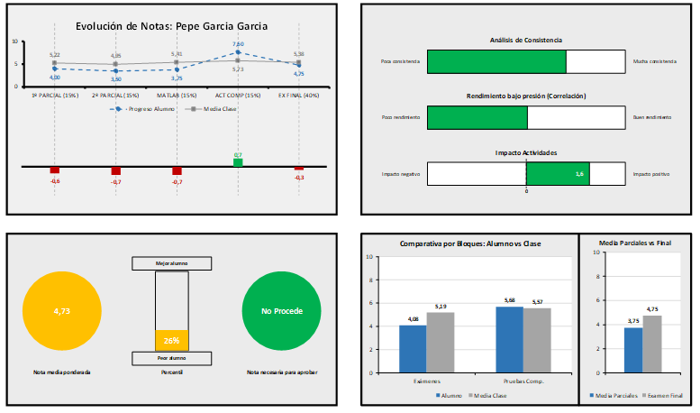

 

  <h1>Sistema de Análisis Académico Automatizado</h1>
  
<i>Desarrollo de una herramienta integral en Excel-VBA para la gestión de resultados y generación de informes estadísticos.</i>

  
<b>Trabajo Fin de Grado - Ingeniería Mecánica (CUD / ENM)</b>

---

## Resumen del Proyecto
Esta herramienta ha sido diseñada para optimizar la gestión docente en el **Centro Universitario de la Defensa**. Mediante programación avanzada en **VBA**, la aplicación permite transformar actas de calificaciones en diagnósticos detallados, evaluando tanto el rendimiento individual del alumnado como la calidad psicométrica de las pruebas de evaluación.

---

## Funcionalidades Principales

### Inteligencia de Datos y Patrones
La herramienta no solo calcula notas, sino que utiliza algoritmos para identificar perfiles específicos:
* **Identificación de "Alumnos Tipo":** Clasificación automática en perfiles (Constante, Evolutivo Positivo, Riesgo Académico, etc.).
* **Caracterización de "Exámenes Tipo":** Análisis de la prueba (Discriminativa, Fácil, Difícil, etc.) basado en índices de dificultad y discriminación.

### Parámetros Estadísticos
Cálculo automatizado de métricas de alto nivel:
* **Estadística Descriptiva:** Media, Mediana, Desviación Típica.
* **Análisis de Distribución:** Coeficientes de Asimetría y Curtosis.
* **Métricas Educativas:** Índice de Dificultad e Índice de Discriminación.

### Generación de Informes y Visualización
* **Informes Narrativos:** Traducción de datos numéricos a texto coherente de forma automatizada.
* **Gráficos Dinámicos:** Generación síncrona de Gráficos.
* **Exportación:** Generación de informes en formato PDF.

---

## Vista Previa 

| Interfaz de Usuario | Informe Examen | Informe Alumno|
| :---: | :---: | :---: |
|  |  |  |
| *Formularios de control VBA* | *Gráficos Estadísticos* | *Gráficos Estadísticos* |

---

## Estructura del Repositorio

* **`/src`**: Módulos de código fuente.
* **`/docs`**: Documentación del proyecto y Memoria del TFG.

---

## Instrucciones de Uso
1.  **Descargar:** Clona el repositorio o descarga el archivo `.xlsm`.
2.  **Seguridad:** Al abrir el archivo, haz clic en **"Habilitar macros"**.
3.  **Carga:** Introduce las notas en la hoja "Notas".
4.  **Ejecución:** Utiliza los botones para generar los informes deseados (Examen, Alumno o Acta Final).

---

## Autor y Dirección
* **Autor:** Miguel Triguero Romero
* **Director:** Sergio Borrallo Tirado
* **Institución:** Centro Universitario de la Defensa en la Escuela Naval Militar (Universidade de Vigo).
* **Curso:** 2025-2026

---

  Este proyecto ha sido desarrollado como parte del Grado en Ingeniería Mecánica.

